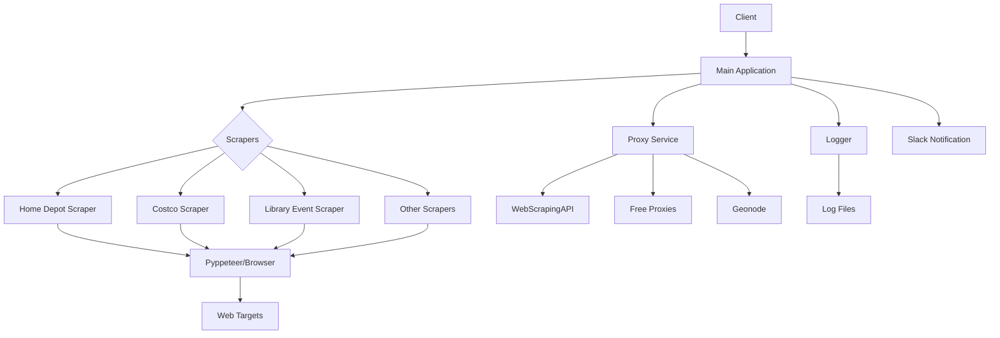

# pyppeteer-scraper

A powerful web scraping solution built with PyPpeteer for automated data
extraction.

## Overview

This project provides a flexible framework for web scraping using PyPpeteer, a
Python port of the Puppeteer JavaScript library. It features various scrapers
for different websites and includes proxy support, Slack notifications, and
robust logging.

## Architecture



## Features

- Headless browser automation with PyPpeteer
- Multiple target-specific scrapers (Home Depot, Costco, libraries, etc.)
- Proxy support for avoiding rate limits
- Slack integration for notifications
- Comprehensive logging system
- Deployment support for Raspberry Pi and other platforms

## References

- [PyPpeteer Official Repository](https://github.com/pyppeteer/pyppeteer)
- [Web Scraping with PyPpeteer](https://www.webscrapingapi.com/pyppeteer)
- [Python Playwright Guide](https://blog.apify.com/python-playwright/)

## Environment Variables

### Proxy Configuration (Optional)

- `API_KEY`: Proxy server API key
- `API_URL`: Proxy server URL (no trailing slash)
  - Example: `https://proxy.scrapeops.io/v1`
  - Example: `https://api.webscrapingapi.com/v1`
- `API_USER`: Username for API authentication
  - Note: WebScrapingAPI does not require this

### Slack Integration

- `SLACK_API_TOKEN`: Your Slack API token for notifications
- `CHANNEL_ID`: Target Slack channel ID
  - To find this: Right-click on the channel name → Select "View channel
    details" → ID is shown at the bottom of the window
- `BROWSER_PATH`: Path to your Chromium browser executable
  - Raspberry Pi: `/usr/bin/chromium-browser`
  - macOS: `/Applications/Chromium.app/Contents/MacOS/Chromium`
  - Linux Mint: `/usr/bin/chromium`

## Installation

```sh
# Clone the repository
git clone https://github.com/yourusername/pyppeteer-scraper.git
cd pyppeteer-scraper

# Set up a virtual environment
python -m venv venv
source venv/bin/activate  # On Windows: venv\Scripts\activate

# Install dependencies
pip install -r requirements.txt
```

## Deployment on Raspberry Pi

### Using Playwright as a Scraper
```sh
pip install playwright
playwright install
```

### Troubleshooting: OSError: [Errno 8] Exec format error

If you encounter this error with Chromium on Raspberry Pi:

1. If Chromium is already installed:
   ```sh
   cd /home/pi/.local/share/pyppeteer/local-chromium/588429/chrome-linux/
   # Remove any existing files
   rm -f chrome
   # Create a symbolic link to your system's Chromium
   ln -s /usr/bin/chromium chrome
   ```

2. If Chromium is not installed:
   ```sh
   sudo apt install chromium -y
   ```
   Then follow the steps above to create the symbolic link.

## Scheduled Tasks (Cron Jobs)

### Raspberry Pi Configuration
```shell
# Run Home Depot scraper hourly between 7AM and 10PM
0 7-22 * * * cd /home/pi/Projects/pyppeteer-scraper; venv/bin/python scraper/home_depo.py > /tmp/stdout.log 2> /tmp/stderr.log

# Run library event scraper hourly between 7AM and 10PM
0 7-22 * * * cd /home/pi/Projects/pyppeteer-scraper; venv/bin/python scraper/library_event.py > /tmp/stdout.log 2> /tmp/stderr.log

# Run Stonebridge event scraper daily at 9AM
0 9 * * * cd /home/pi/Projects/pyppeteer-scraper; venv/bin/python scraper/stonebridge_event.py > /tmp/stdout.log 2> /tmp/stderr.log

# Weekly log cleanup (Sundays at midnight)
0 0 * * 0 cd /home/pi/Projects/pyppeteer-scraper; venv/bin/python my_logger/cleanup.py > /tmp/stdout.log 2> /tmp/stderr.log
```

### macOS Configuration
```shell
# Run Home Depot scraper hourly on weekdays between 9AM and 4PM
0 9-16 * * 1-5 cd /Users/yourusername/Projects/pyppeteer-scraper && /Users/yourusername/anaconda3/envs/pyppeteer/bin/python scraper/home_depo.py > /tmp/stdout.log 2> /tmp/stderr.log
```

## Costco Scraper Setup

### ChromeDriver Installation

- Raspberry Pi: `sudo apt-get install chromium-chromedriver`
  - Path: `/usr/bin/chromedriver`
- macOS: `brew install chromedriver`
  - Path: `/opt/homebrew/bin/chromedriver`

## Testing

### Home Depot Workshop Registration Test
```sh
python -c "import sys; sys.path.append('/path/to/pyppeteer-scraper'); from scraper.home_depo import register_home_depot_workshop; success, response = register_home_depot_workshop('KWTM0001', dry_run=True); print(response)"
```

## Contributing

Contributions are welcome! Please feel free to submit a Pull Request.

## License

This project is licensed under the MIT License - see the LICENSE file for
details.
