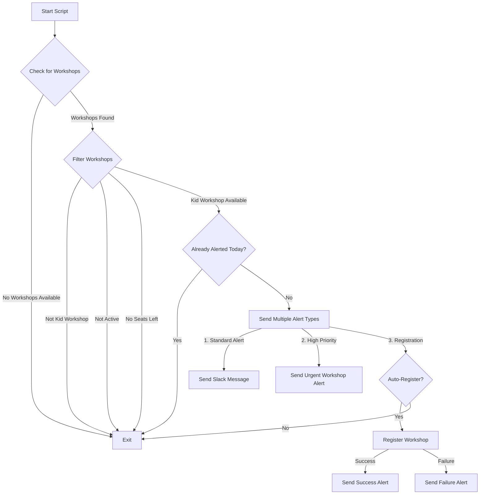
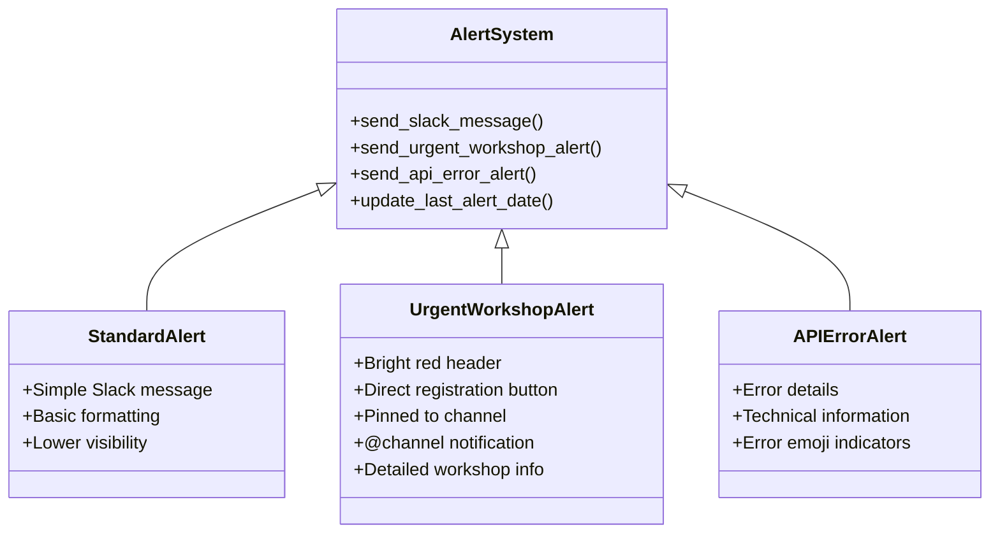
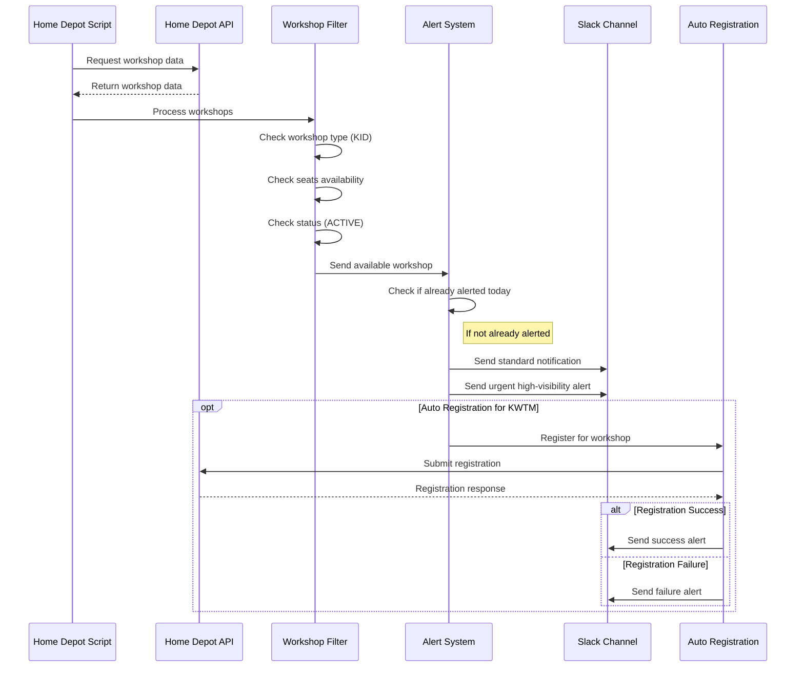
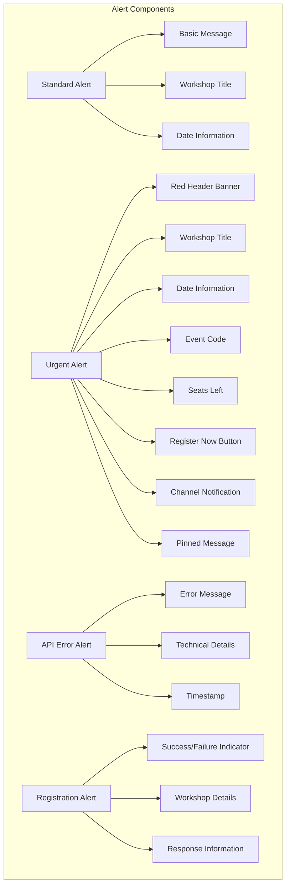
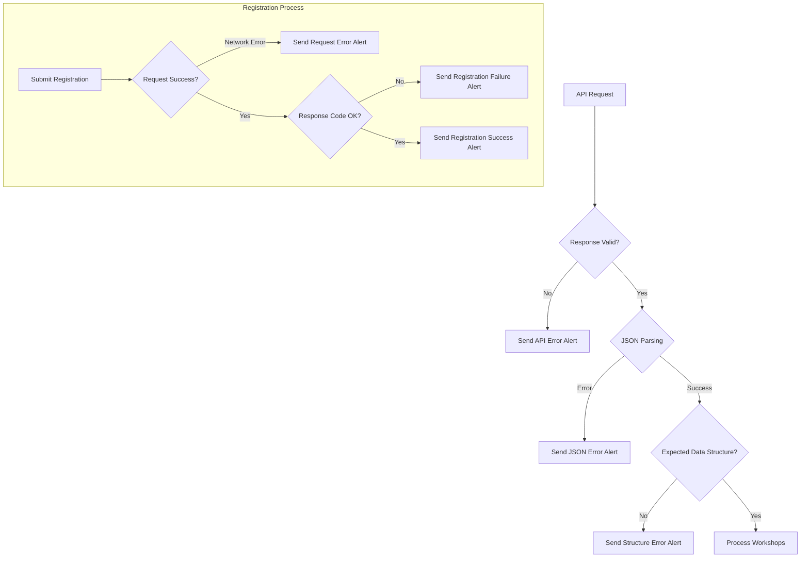
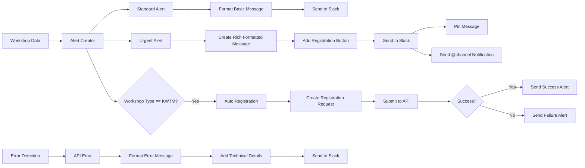
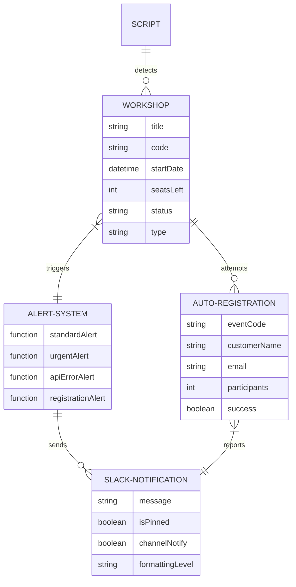

# Home Depot Workshop Alert System

This document explains the workshop alert system using diagrams to visualize the flow and components.

## 1. Overall System Flow

## 2. Alert Types Hierarchy

## 3. Workshop Detection & Alert Process

## 4. Alert Components Visual Hierarchy

## 5. Error Handling Flow

## 6. Alert System Data Flow

## 7. Component Relationship Diagram

